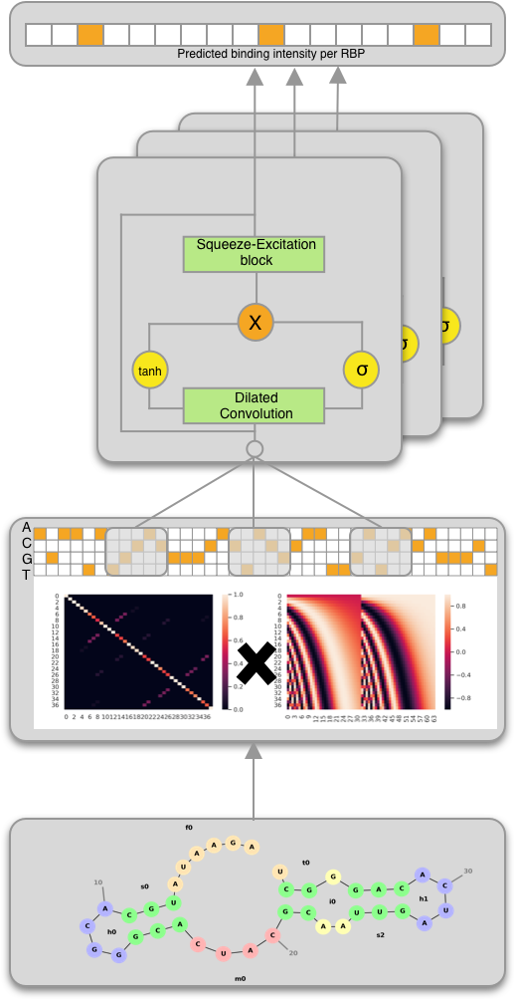
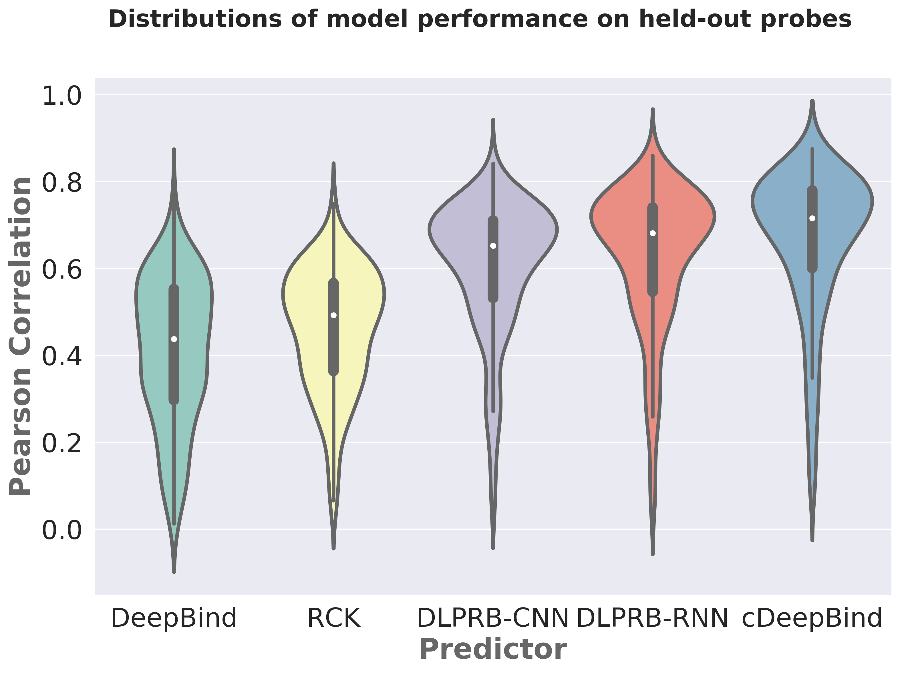
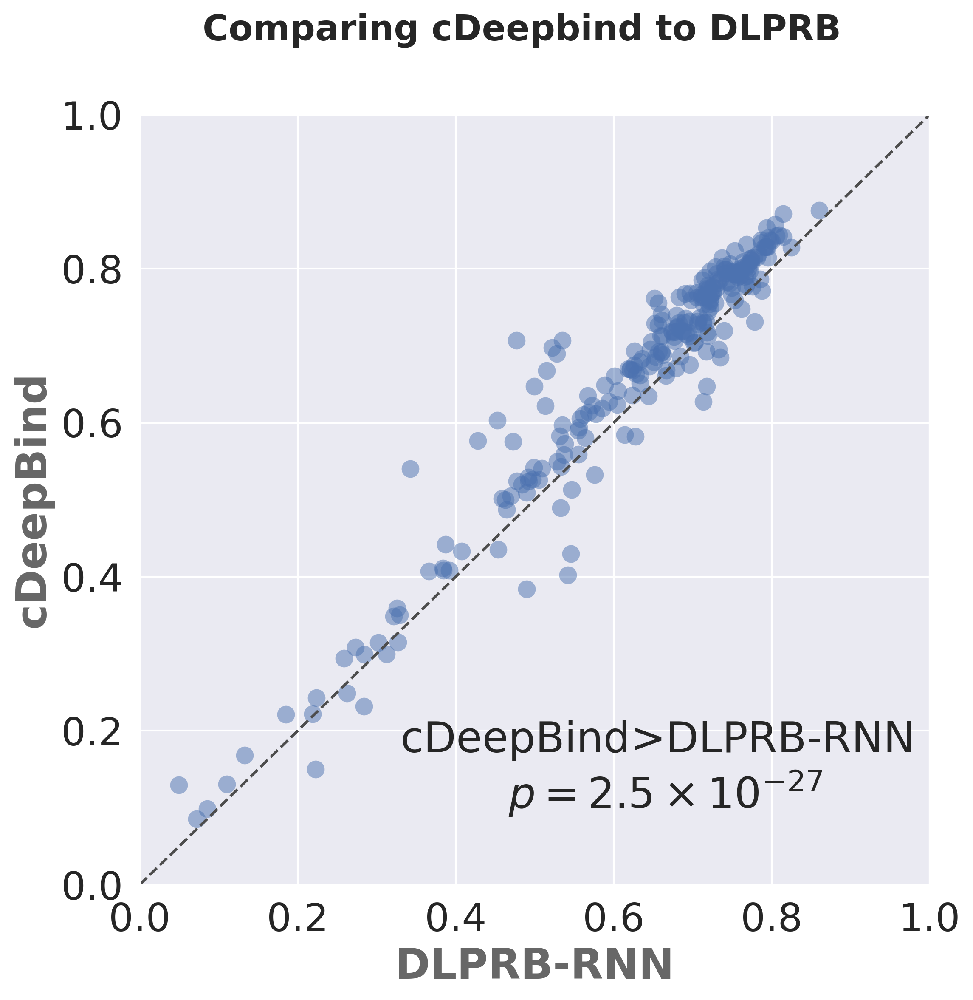

#cDeepBind
cDeepBind is a fast and accurate model for learning sequence and structure specificities of RNA binding proteins.
 

## Model architecture



##  Reproducing the training and evaluation workflow

Setup an environment that contains all the necessary packages first.
```bash
conda env create -f environment.yml
conda activate cdeepbind
python setup.py develop
```

To train a new model follow:
```bash
python encode_data.py -d 2013
python train_model.py
```

To run evaluations on a pre-trained model follow:
```bash
python evaluate_model.py
```

## Results



